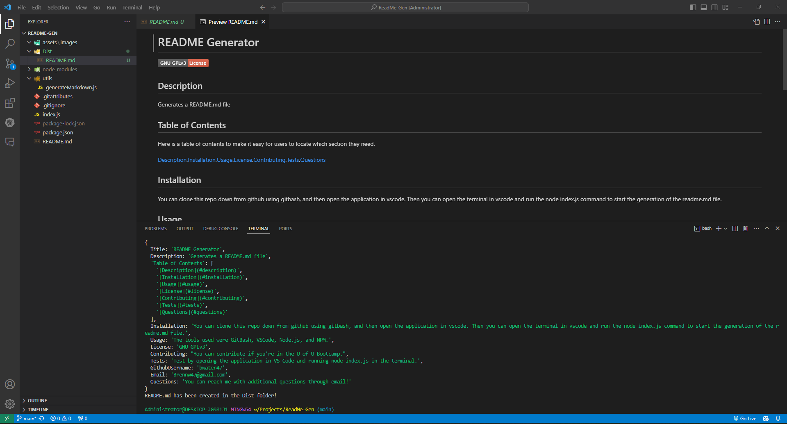

# ReadMe-Gen

Application that generates a README.md for the user.

## Description

- My motivation for building this application was to create something that helps coders generate a README.md file for their repo.
- This project was built to help coders create a README.md file for their projects.
- This solves the problem of not knowing the process of creating a README.md.
- In this project I learned that you can use node.js to run, and test your javascript files from the CLI in VS Code.

## Table of Contents (Optional)

Here is a table of contents to make it easy for users to locate which section they need.

- [Installation](#installation)
- [Usage](#usage)
- [Credits](#credits)
- [License](#license)

## Installation

You'll need to install GitBash, VS Code, and Node.js. From here you will need knowledge on how to clone a repo from GitHub over to your device to store it locally. Once its stored locally in your device you can open VSCode. Lastly once VSCode is running, open the CLI (Command-Line-Interface), make sure the current directory (CD) is targeted at the assets folder, and type node index.js to be prompted with the questions for the README.md.

## Usage

Generating a README.md file: Use node.js inside of VS Code, make sure you are inside of the assets folder in the terminal using the CD command in the CLI of VS Code (CTRL + `), and target the index.js file when using the "node path.file" command in the terminal on VS Code. This will prompt you with questions that you will fill out. Once completed you will recieve a message in the console that tells you where the README.md file is that you have generated.

ReadMe-Gen sample: [https://docs.google.com/document/d/1WMk-lqSAXMWpLxWJKqHxGPX0hFvzSFSz46DRb57WjcM/edit?usp=sharing](https://docs.google.com/document/d/1WMk-lqSAXMWpLxWJKqHxGPX0hFvzSFSz46DRb57WjcM/edit?usp=sharing)

ReadMe-Gen video: [https://drive.google.com/file/d/1yBHVXSvU2U6-Nnn2QI4QlLqZBsQbj-Pr/view?usp=sharing](https://drive.google.com/file/d/1yBHVXSvU2U6-Nnn2QI4QlLqZBsQbj-Pr/view?usp=sharing)

README.md screenshots:

## Support

N/A

## Credits

People who worked on this project were bwater47. You can contact the contributors through the github profiles links listed here.
- Link: <a href="https://github.com/bwater47" alt="GitHub Link">GitHub Profile</a>

## License

This is an [https://choosealicense.com/licenses/mit/](https://choosealicense.com/licenses/mit/) license.

## Features

README.md Generator: Uses Node.js, GitBash, VS Code, and NPM.

## Contributing
Contributing is allowed if you're in the U of U Coding Bootcamp. Contact us on the slack channel for information. [Contributor Covenant](https://www.contributor-covenant.org/)

## Authors and Acknowledgment
CLI commands. npm Docs. (04/28/2024). https://docs.npmjs.com/cli/v10/commands 

Node.js V22.0.0 documentation. Command-line API | Node.js v22.0.0 Documentation. (04/28/2024). https://nodejs.org/api/cli.html 

Bootcamp Spot. (04/28/2024). https://bootcampspot.com/

W3Schools Online Web Tutorials. (04/28/2024). https://www.w3schools.com/ 

Chatgpt. ChatGPT. (04/28/2024). https://openai.com/chatgpt

• Please note: While ChatGPT was utilized to generate dialog content for the README file, it was not involved in the generation of any code, HTML edits, CSS edits, or other assets within the repository apart from this README specifically.

• All other sources, links, and information utilized within the project were obtained from the provided sources mentioned in this paragraph. This includes class materials, modules, TA guidance, instructor-provided resources, as well as communication through platforms such as Slack or Discord. Additionally, numerous links and resources were provided within the assignment instructions and demonstrated during class sessions.

## Roadmap

Tests: N/A

## Project status
Complete